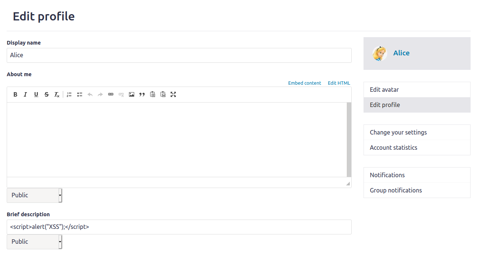
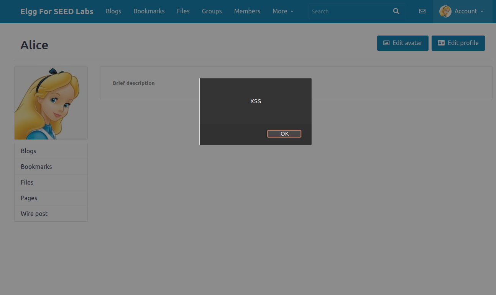
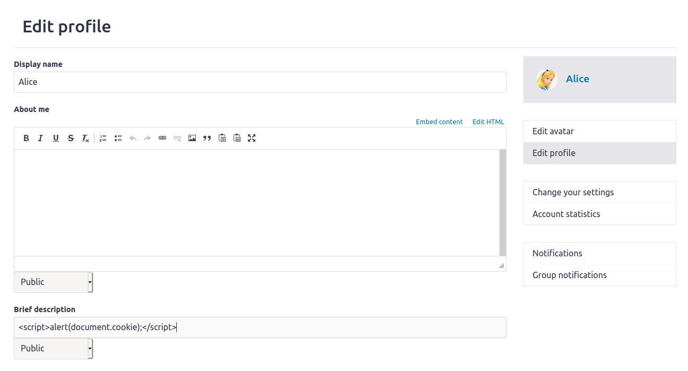
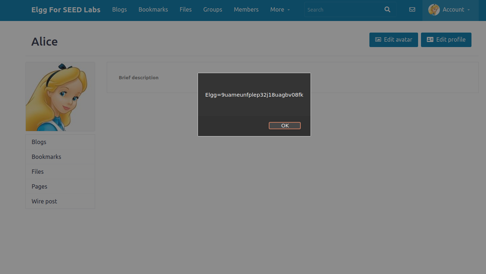
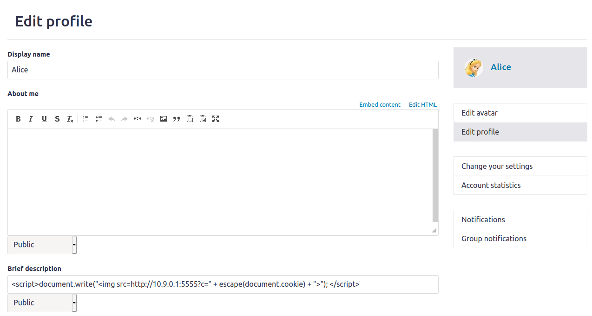
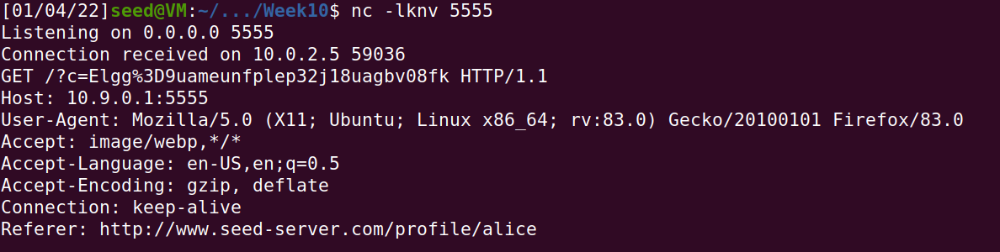
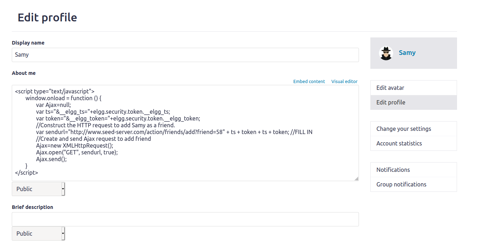
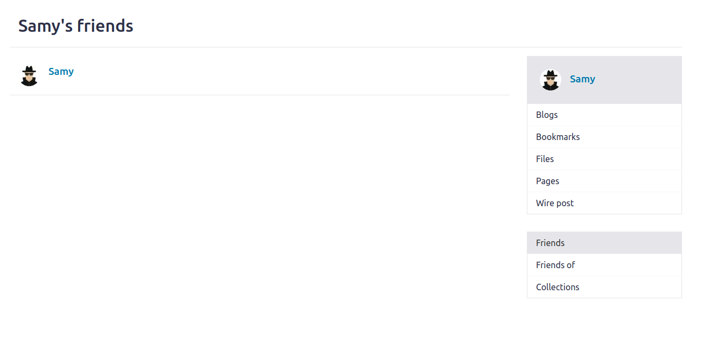
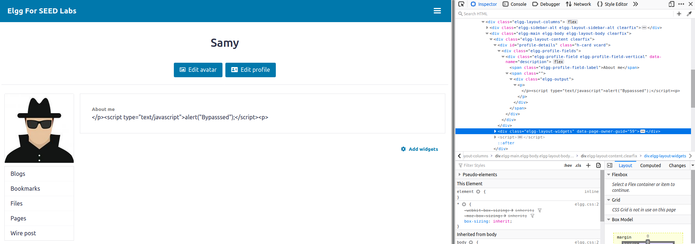

# Week 10

## Task 1

We putted the payload in the **brief description** camp, and the result can be seen in Figure 2. The payload is fairly simple since there aren't any active counter measure for XSS attacks.

*Figure 1.1: Payload*

*Figure 1.2: XSS attack result*

## Task 2
To get the user cookie, we simply changed the payload to include the code `document.cookie`. The result can be seen in Figure 2.2.

*Figure 2.1: Payload*

*Figure 2.2: XSS attack result*

## Task 3
To steal the user cookie, we introduce an image tag that has the source an IP controled by us. With this, the user will send a GET request to the source, along with its cookie . Using netscape, we can activily listen to a port and receive incoming request. The result can be seen in Figure 3.2.

*Figure 3.1: Payload*

*Figure 3.2: XSS attack result*

## Task 4
Before writting the payload, we need to know how does user add a friend. Using the tool HTTP Header Live, we discovered the structure of the HTTP request ([here](../Week10/tasks/http_req.txt)). So, the user needs to send a request to www.seed-server.com/action/friends/add with the friend he wants to add and an **elgg_ts** and a **elgg_token** twice repeated. EXPLICAR TS E TOKEN.
Everyone has an unique friend ID. To find Samy's ID, we loggin in as Alice and sent a friend request to Samy.
After introducing the payload in the About Me field and saving, we can see that Samy is now a friend of himself (since he visited his own profile).

*Figure 4.1: Payload*

*Figure 4.2: XSS attack result*

Using Text Mode, is not possible to do a XSS attack, since that in this mode the content of the field is sanitized (Figure 4.3).

*Figure 4.3: Attempt to break Text Mode*