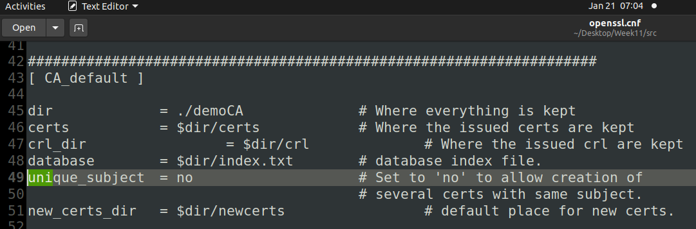
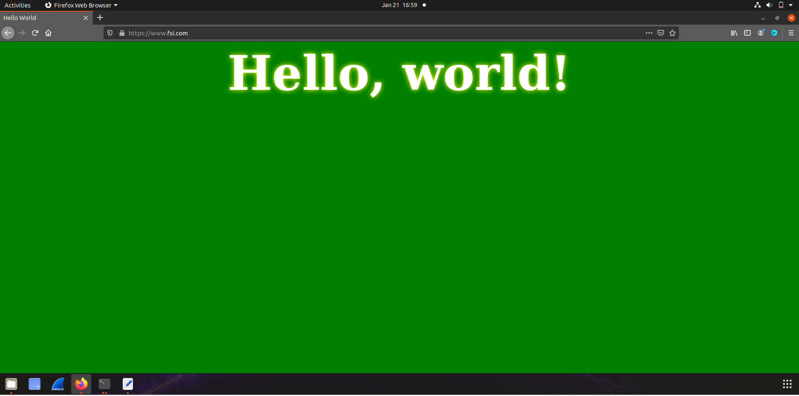

# Week 11

## Task 1

First, we copied the file to our working directory and uncommented the `unique_subject` line (Figure 1.1)


*Figure 1.1*

Then, we created an empty file named `index.txt` and a ``serial`` file with 1000 on it.  

To create the self-signed certificate, we runned the following command:
```
openssl req -x509 -newkey rsa:4096 -sha256 -days 3650 \
-keyout ca.key -out ca.crt \
-subj "/CN=www.modelCA.com/O=Model CA LTD./C=US" \
-passout pass:dees
```

As a result, two files were created: `ca.key` with the CA's private key, and `ca.crt` with the public key.

After this, we executed the following commands:
```
openssl x509 -in ca.crt -text -noout (1)
openssl rsa -in ca.key -text -noout (2)
```

The output of command (1) can be seen [here](../Week11/file1_task1.txt), while the output of command (2) can be seen [here](../Week11/file2_task1.txt).


Finally, we answered the following questions:

### Q: What part of the certificate indicates this is a CA’s certificate?
A: In the file (1) (the file containing the output of command (1)), we can see the following section:
```
        X509v3 extensions:
            X509v3 Subject Key Identifier: 
                AC:26:2B:45:40:B1:CF:14:9C:3C:74:FA:08:5A:3B:02:D4:BF:94:E7
            X509v3 Authority Key Identifier: 
                keyid:AC:26:2B:45:40:B1:CF:14:9C:3C:74:FA:08:5A:3B:02:D4:BF:94:E7

            X509v3 Basic Constraints: critical
                CA:TRUE
```
This section contains the flag CA set to TRUE, indicating that it's a CA's certificate

### Q: What part of the certificate indicates this is a self-signed certificate?
A: In the following section, we can see that the ``Issuer`` is equal to the `Subject`
```
        Issuer: CN = www.modelCA.com, O = Model CA LTD., C = US
        Validity
            Not Before: Jan 21 12:51:21 2022 GMT
            Not After : Jan 19 12:51:21 2032 GMT
        Subject: CN = www.modelCA.com, O = Model CA LTD., C = US
```

### Q: In the RSA algorithm, we have a public exponent e, a private exponent d, a modulus n, and two secret numbers p and q, such that n = pq. Please identify the values for these elements in your certificate and key files.
A: All of this values are present in [file](../Week11/file2_task1.txt) (2) (the one generated by ca.key). The modules is on line 3 to 37, e is equal to 65537, d is on lines 40 to 74, p and q are present in lines 76-93 and 95-112. We didn't copy paste the number, since they are very large numbers.

## Task 2
To generate a CSR for our server, named `fsi`, we executed the following command:
```
openssl req -newkey rsa:2048 -sha256 \
    -keyout server.key -out server.csr \
    -subj "/CN=www.fsi.com/O=Fsi Inc./C=US" \
    -passout pass:dees \
    -addext "subjectAltName = DNS:www.fsi.com, \
        DNS:www.fsiA.com, \
        DNS:www.fsiB.com"
```
Two files were created by this command: [server.key](../Week11/server.key) and [server.csr](../Week11/server.csr). We added the last tag `-addext` to add more hostnames to the certificate.

After this, we executed the following to commands, to print the decoded content of the created files. File (1) can be found [here](../Week11/file1_task2.txt) and file (2) can be found [here](../Week11/file2_task2.txt).
```
openssl req -in server.csr -text -noout (1)
openssl rsa -in server.key -text -noout (2)
```

## Task 3
First, we uncommented the `copy_extensions = copy` line, to allow the
the copy of the extension field from the request to the a certificate.

Next, we runned the following command, to turn the CSR into a X509 certificate:

```
openssl ca -config openssl.cnf -policy policy_anything \
    -md sha256 -days 3650 \
    -in server.csr -out server.crt -batch \
    -cert ca.crt -keyfile ca.key
```

After signing, we executed the following command to print out the decoded content of the certificate. The results can be seen [here](../Week11/file1_task3.txt)
```
openssl x509 -in server.crt -text -noout
```

The section with the alternative names is the one that follows (line 44-45):
```
            X509v3 Subject Alternative Name: 
                DNS:www.fsi.com, DNS:www.fsiA.com, DNS:www.fsiB.com
```

## Task 4
First we need to set up an HTTPS site. To that, we need first to copy the keys from the previous task (server.crt and server.key) to a `/certs` directory.
Then, we need to change the `VirtualHost` sections of the [fsi_apache_ssl.conf](../Week11/fsi_apache_ssl.conf). After the alterations, the file now contains this:
```
<VirtualHost *:443> 
    DocumentRoot /var/www/fsi
    ServerName www.fsi.com
    ServerAlias www.fsiA.com
    ServerAlias www.fsiB.com
    DirectoryIndex index.html
    SSLEngine On 
    SSLCertificateFile /certs/server.crt
    SSLCertificateKeyFile /certs/server.key
</VirtualHost>

<VirtualHost *:80> 
    DocumentRoot /var/www/fsi
    ServerName www.fsi.com
    DirectoryIndex index_red.html
</VirtualHost>

# Set the following gloal entry to suppress an annoying warning message
ServerName localhost
```

We need also to change the [DockerFile](../Week11/Dockerfile) to the specifications of our HTTPS site:

```dockerfile
FROM handsonsecurity/seed-server:apache-php

ARG WWWDIR=/var/www/fsi

COPY ./index.html ./index_red.html $WWWDIR/
COPY ./fsi_apache_ssl.conf /etc/apache2/sites-available
COPY ./certs/server.crt ./certs/server.key  /certs/

RUN  chmod 400 /certs/server.key \
     && chmod 644 $WWWDIR/index.html \
     && chmod 644 $WWWDIR/index_red.html \
     && a2ensite fsi_apache_ssl   

CMD  tail -f /dev/null
```

Finally, to start the site, we need to run `service apache2 start`. When we try to access through the browser, we get a security error. This is because Firefox does not recognize the CA as a valid one, since it is not present in its CA list. To fix this, we need to import the certificate to the list of valid ones of Firefox.
After doing the above, when we tried to access the site, we were greeted with the figure bellow


*Figure 4.1*