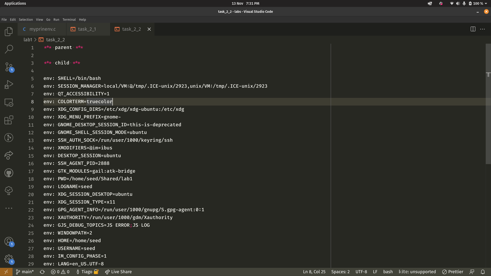
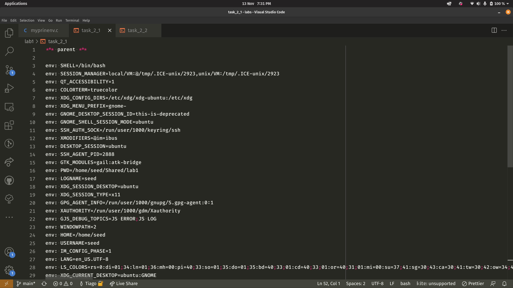
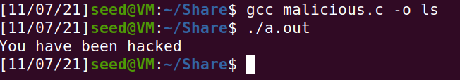

# Week 4

## Task 1

In this simple task we learn how to manipulate environment variables of a system. By running `printenv` or `env` we can see a list of all the available and existing variables for the systems environment and by running `export` and `unset` we can create new ones or delete existing variables respectively.

## Task 2

After compiling `myprintenv.c` we verified that the environment variables in `environ` are printed both in the parent and child processes. 

| child | parent |
|-----|-----|
|||

This indicates that the system environment variables are accessible from child processes as well and can be passed from parent to child (as part of environment export/inheritance). This poses a potential security risk because if an attacker decides to fork a given proccess the resulting children will have at their disposal the system's environment variables that could be manipulated.

## Task 3

After running step 1 with the third argument of execve as NULL, the output is nonexistent, therefore we concluded that the environment variables are not kept after execve overrides the old process code.

In step 2, the environment variables were passed as an argument to the execve call, so the new code that is running(code after execve call) can access the caller environment variables.

The new program, after execve call does not have access to the environment variables. However if they are passed to it by the caller it can have acces to them.

## Task 4

After running the code on task 4, we were able to conclude that program called by system was able to access the user environment variables.

## Task 5

After executing [the code](../Week4/myenv.c), changing the owner and permissions and adding the enviromnet variables, we were presented with the following output:

None of the variables set in the shell process where in the child process. This was expected, since the file had its ownership changed to root, it also had root environment variables.

## Task 6
We added to the path our working directory that contained a compiled program called [ls](../Week4/ls). Our version of ls prints to the screen "You have been hacked" ([here](../Week4/malicious.c) is the source file). When the provided [code](../Week4/set_uid.c) executed, since it calls the system function, it uses the Path that we defined to locate the executable  and runs our version of ls.

