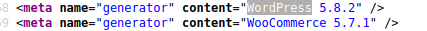
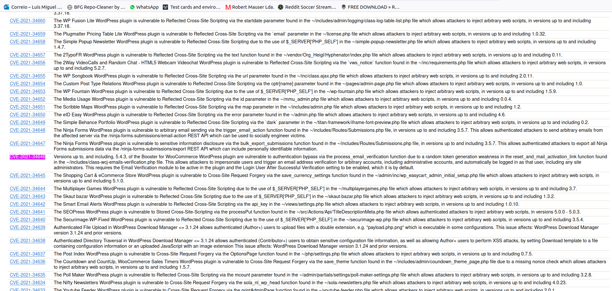
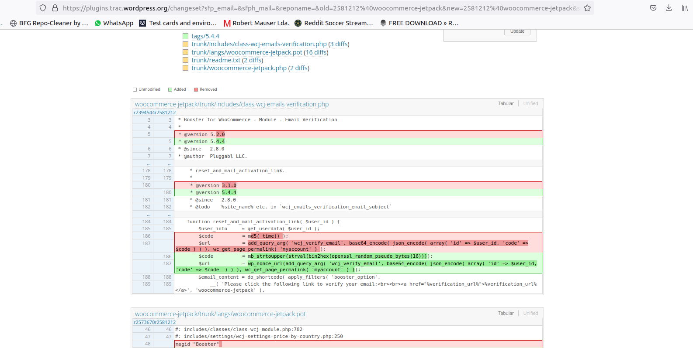
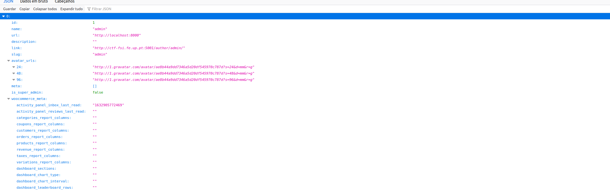
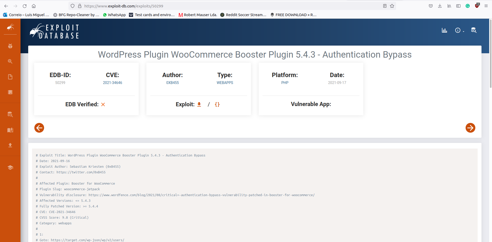
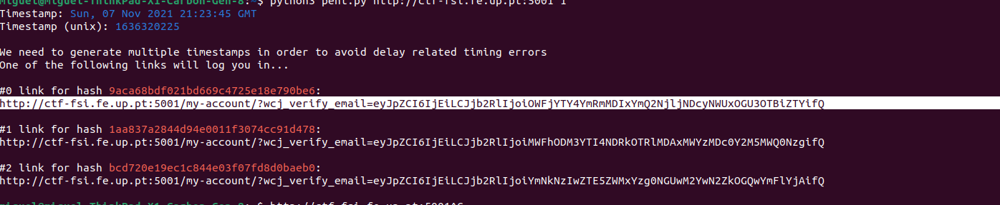
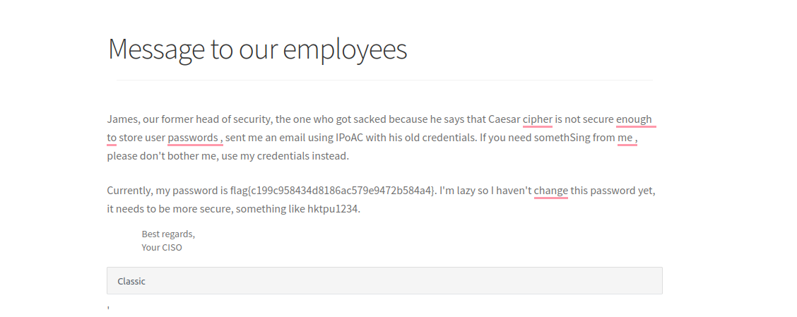

# Week 4

## Task 1

In this simple task we learn how to manipulate environment variables of a system. By running `printenv` or `env` we can see a list of all the available and existing variables for the systems environment and by running `export` and `unset` we can create new ones or delete existing variables respectively.

## Task 2

After compiling `myprintenv.c` we verified that the environment variables in `environ` are printed both in the parent and child processes. 


This indicates that the system environment variables are accessible from child processes as well and can be passed from parent to child (as part of environment export/inheritance). This poses a potential security risk because if an attacker decides to fork a given proccess the resulting children will have at their disposal the system's environment variables that could be manipulated.

## Task 3

After running step 1 with the third argument of execve as NULL, the output is nonexistent, therefore we concluded that the environment variables are not kept after execve overrides the old process code.

In step 2, the environment variables were passed as an argument to the execve call, so the new code that is running(code after execve call) can access the caller environment variables.

The new program, after execve call does not have access to the environment variables. However, if they are passed to it by the caller, it can have access to them.

## Task 4

After running the code on task 4, we were able to conclude that a program called by the "system" call was able to access the user environment variables, retrieving them directly from the System and not from the process variables.

## Task 5

After executing [the code](../Week4/myenv.c), changing the owner and permissions:
```bash    
$ sudo chown root set_uid.o
$ sudo chmod 4755 set_uid.o
```
 and adding the enviromnet variables:
 ```bash
 $ export PATH
 $ export LD LIBRARY PATH
 $ export G7
 ```
 
 we were presented [this](../Week4/task5_envvars.txt) environment variables

None of the variables set before were in the child process. This was expected, since the file had its ownership changed to root and the set-uid bit set, it runs as root  and also has root environment variables.

## Task 6
We added to the path our working directory that contained a compiled program called [ls](../Week4/ls):
 ```bash
 $ export PATH=/home/seed/Share/m07g07/Week4:$PATH 
 ```

Our version of ls prints to the screen `"You have been hacked"` ([here](../Week4/malicious.c) is the source file). 

When the provided [code](../Week4/set_uid.c) is executed, it calls the `system` function and tries to locate the ls binary. Since it is using our environmet variables, and we added to the begining of PATH the location of our version of ls, it runs our program.


# CTF

The first step was to find information about the website so we could find vulnerabilities on the software. After a quick look at the website source code   
we were able to find both the WordPress version and also the Woocommerce plugin version.

Following that, we made a search for vunerabilities on both wordpress and the Woocommerce plugin that would affect the specified versions(wordpress 5.8.2 woocommerce 5.7.1).
We were able to find a bug on the woocommerce boost module, described on the CVE-2021-34646.  
The bug consisted on the way the url for the recovery password link was being generated. It used a simple md5 hash combining the current time with the user id.   
After that we went to discover the user id with(admin user is usualy number 1).   

We runned the link creator script found on the internet. 

The script generated the recovery call with curl. After that, taking in account the response time, created 3 different links that varied the time used for the hash creation(network delays could mean the link was generated with a diferent time from the time the curl call was returned). For example, if the curl call would have returned with a unix time of 45456, the script tried the links with 45454,45455 and 45456 on the time part of the hash. 

In our case the first link was the one that worked.  

After that we simply navigated the website and found the internal memo with the flag number.
 


