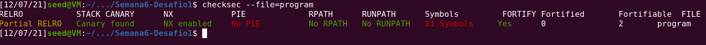
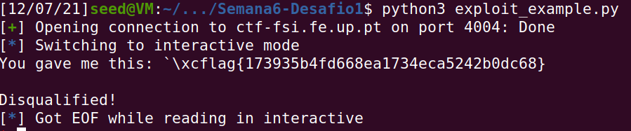
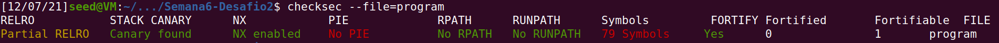
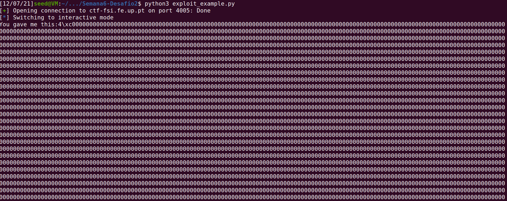
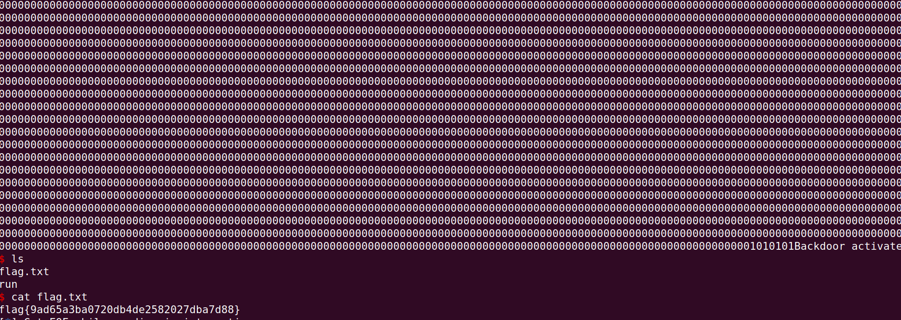

# Week 6

## Task 1

To crash the program, we provided the following string: `hello %s`. This string will tell `printf` function that it's expecting an string argument (because of the *%s*). Since there is none, the program will read a invalid address for the string from the argument pointer and it will crash the program.

## Task 2
In this task we try to read variables from the stack. First we discover the length of the input so we can, with the "%x", read our input from the stack. After "%x" 64 times the printf pointer is pointing to the first values we passed to the server.

The Next step was to read the value of the secret message(quite a funny content...."Secret Message"XD). To do so, the 4 first bytes are the address of the Secret address, then we add 63 "%x"(it makes the pointer move) and the a "%s".This takes the next value(it assumes it is an address) pointed by the pointer and prints the content of that address.  Since the next value is the first value we put on the server, the "%s" prints the value of the address we chose.

## Task 3

USing the knoledge of the previous task, we put the fisrt values to be the address we want to change. then use "%x" to move the pointer and use "%x" that will save a number(number of read char until that %n appeared) into the address specified on the next value on th epointer. As mentioned before, the first value is the address of the variable we want to change. Given that we are able to change the value of the address we want.

At a first glance, the value "%n" puts on the address cannot be defined, however we are able to use dummy char that allow us to print more char than the size of the string. Using that we can simulate that the printf read an arbitrary number of char.
We used the number 19980 that was the result of 0x5000 in decimal subtracted by the padding number of "%x" values time 8.
"%.19980u" allow us to print a huge number of things(19980) without having to have them all specified in the input we send to the server.

## CTF 

### Challenge 1

The program has the following protections:
- **Partial RELRO**: Means that only part of the Global Offset Table is read-only.
-  **Canary**: Puts a canary between some variables on the stack. If the canary is overwritten, the program stops.
-  **NX enable**: The stack hasn't execution permission.
-  **No PIE**: The addresses aren't randomized.

This security mechanism makes buffer overflow attack a lot harder. However, it doesn't protect against string format attacks.

After analysing the [code](../Week6/Semana6-Desafio1/main.c), we concluded that:
- The vulnerable codes lies on line 27 `printf(buffer)`
- The above line of code allows an attacker to print the value of an address of memory or even change the value of it.
- With this in mind, we can print the flag by knowing the address of the variable that holds it.

Using gdb, we found out that the address `0x804c060`. The exploit code can be found [here](../Week6/Semana6-Desafio1/exploit_example.py). By injeting the string `0x804c060%s`, we got the flag:

### Challenge 2

Using checksec, we verified that there were no changes to the program protections:

After analysing the [code](../Week6/Semana6-Desafio2/main.c), we concluded that:
- The vulnerable codes lies on line 27: `printf(buffer)`. This line allows an attacker to print the value of an address of memory or even change the value of it.
- The flag is not loaded to memory. But, if we change the value of the variable **key** to 48.879, we creat a terminal that can be used to dumb the flag 

The address of variable key is `0x804c034`. The exploit code can be found [here](../Week6/Semana6-Desafio2/exploit_example.py). By injeting the string `0x010101804c034%.48871x%n`, we were able to create the shell and dump the flag

