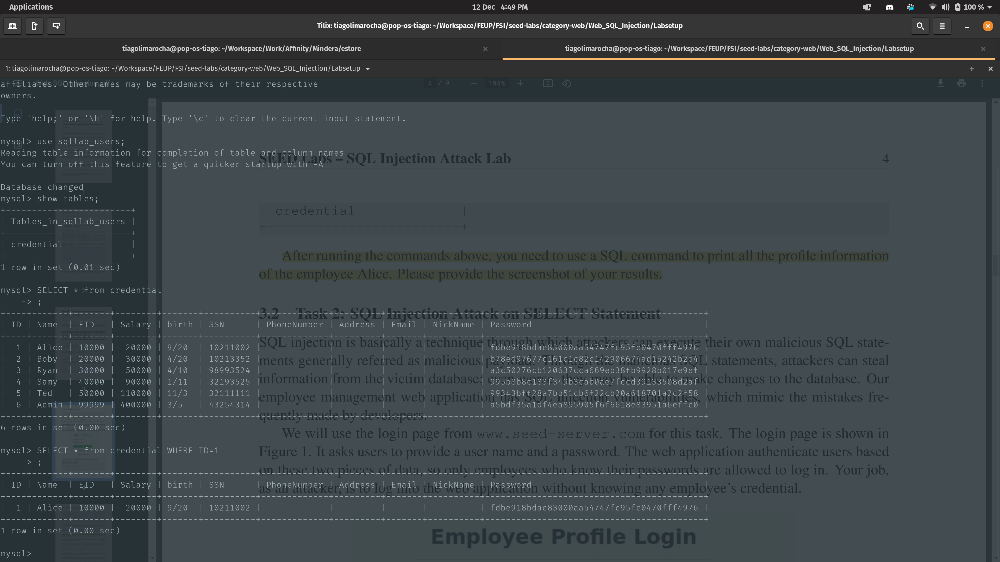

# Week 8

## Task 1

After setting up the configuration for this lab, we executed the commands `docker ps` to get access to the sql container ID, and with it we could execute a shell inside that very same container using `docker exec -it <Contianer ID> bash`.

In the container's shell we could thereafter open a MySql CLI by executing the command `mysql -u root -pdees`, which allowed us to load the existing database `use sqllab_users;` and take a look at the create data: `show tables;`; `SELECT * FROM credential`; `SELECT * from credential WHERE ID=1`;

Here are the results of those queries:

***

## Task 2

***

### Task 2.1

### Task 2.2

### Task 2.3

***

## Task 3
