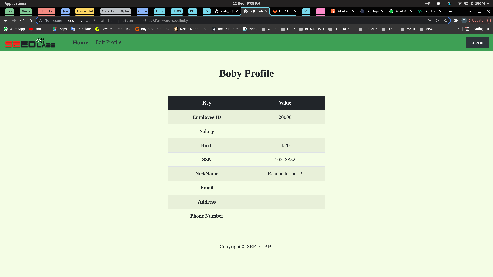

# Week 8

## Task 1

After setting up the configuration for this lab, we executed the commands `docker ps` to get access to the sql container ID, and with it we could execute a shell inside that very same container using `docker exec -it <Contianer ID> bash`.

In the container's shell we could thereafter open a MySql CLI by executing the command `mysql -u root -pdees`, which allowed us to load the existing database `use sqllab_users;` and take a look at the create data: `show tables;`; `SELECT * FROM credential`; `SELECT * from credential WHERE ID=1`;

Here are the results of those queries:

***

## Task 2

***

### Task 2.1

The goal of this task was to log into the application as the administrator from the login page, assuming all we know is the admin's account name: `admin`. In the `Username` input field, after typing a `admin'` we get the following result:

This indicates to us that the website is vulnerable to SQL injection attacks as the extra char `'` after the username created a syntax error in the query.

Now, there are multiple ways we can access the application at admin level. The simplest way we can achieve this is by simply commenting out everything in the WHERE clause of the SQL query **after** the username condition.
*i.e.* in the Usermane input fiel: `admin'; -- `;
By inputing this in the username field we are essencially modifying the original query to accept only the name field as a conditional check: `SELECT ... FROM Table WHERE name='admin'; -- ' and password=...;`.

If the assumption of knowing the username `admin` to exist was invalid we could always input the following in the Username field to gain access as user level: `foo' or 1=1; -- `;

### Task 2.2

In this task we use a curl request to gain access to the app's content at admin level. For that we needed to open up a shell in the www container and execute the following command: `'http://www.seed-server.com/unsafe_home.php?username=admin%27+--+&Password='`.

Above we see the result of our http request: the html data resulting of the curl.

### Task 2.3

A different approach to task 2.1, would be to use an update statement to change the value of the password: `';UPDATE credential SET Password='chicken' WHERE name='admin'; -- `. This approach is harder to execute as the attacker would need to know what the table name is, if there is any encryption being used and if so what the encryption algorithm is.

Besides all that there is a big limitation that sets us back, and it has to do with the php implementation of the query runner in this application. Essencially to run the queries, they use the `query()` method which allows for single query runs on sql engine. If we wanted to do multiple queries with one function call they would have to have used the `multi_query()` method instead. This is done as a security measure to prevent the code illustrated in the first paragraph to be executed.

***

## Task 3

### Task 3.1

Changing the salary from within authentication walls is a trivial task. Since we are already authorised to change our values in the database, then all we need to do is in the nickname input field type the following data: `Alice', Salary=25000 -- `. This will set the values of name and Salary collumns.

Of course if we didn't want to raise any suspitions we would have to set the values for the remaining collumns as well. But this delivers the point we were trying to make.

### Task 3.2

Much like in the previous task, since we're already executing an UPDATE statement, it's quite easy to inject some malicious SQL to change other people's data (namely our hypothetical horrible boss Boby).
In the first input field (nickname) do: `Be a better boss!', Salarry=1 where name='Boby'; -- `.

And when he logs in he shall have a very unpleasant surprise:

### Task 3.3

Given that we know the encryption algorithm used in this application (that being SHA1), altering someone's password is no different than the previous exercises. We login with our credentials or hack someone's account as shown in 2.1; then in the edit profile page we type the following sql in the nickname input field: `Boby', Password=SHA('frango') where name='Boby' -- `.

And the end result would be catastrophic:

